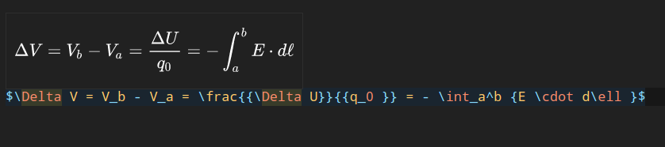

# TeX stuff

## LaTeX environment

[This VS Code package makes writing LaTex great.](https://marketplace.visualstudio.com/items?itemName=James-Yu.latex-workshop)

It provides: 

- Compilation on save.
- Good autocompletion.
- A command to clean build files.
- A PDF viewer in VS Code that updates on save.
- The ability to preview equations by hovering over them, before compilation.

[Install this code spell checker package](https://open-vsx.org/extension/streetsidesoftware/code-spell-checker)
to correct spelling mistakes within LaTeX documents.

To install LaTeX on an Arch based system run -

`sudo pacman -S texlive-most`

and that handles almost anything LaTeX related.

